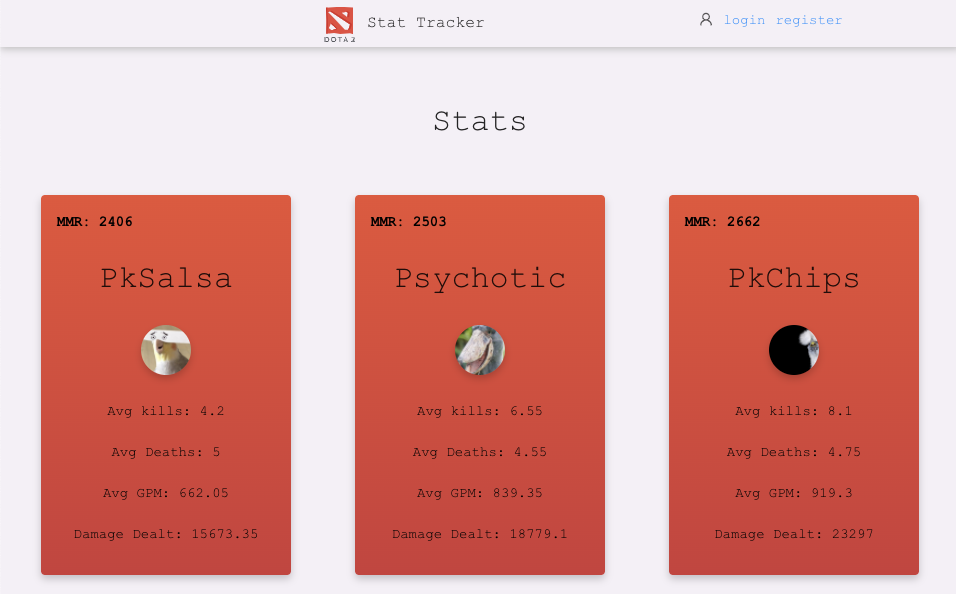
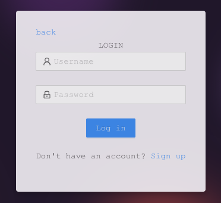
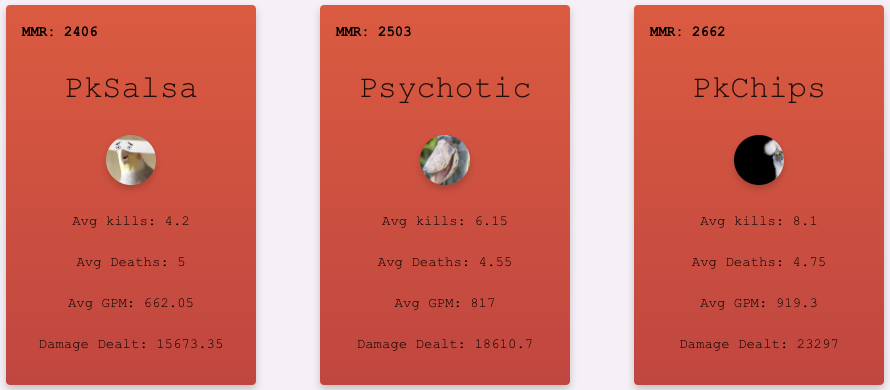
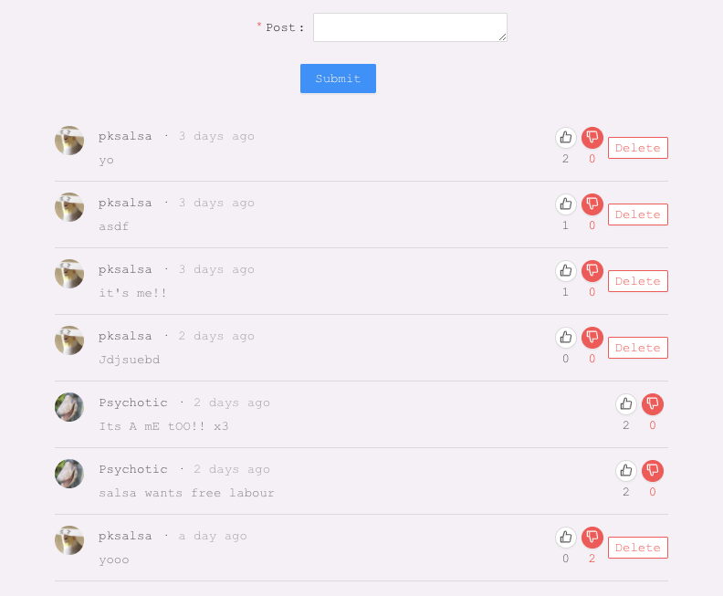

# DotA2 Stat Logger

DotA2 Stat Logger is an app dedicated to the real-time tracking of match-data in the game DotA2.

* [live Demo](https://dota2-stat-tracker.netlify.app/)

## Getting Started

Clone this repo, and cd into the directory

Running the Frontend:

* `npm install` 
* `npm start`

Backend:

Running this app on a Heroku server with MongoDB
* [stat-logger-backend](https://github.com/ALmsq/stat-logger-backend)

## Features

**Authentication**

Auth is implemented on the backend with Passport-jwt auth. 

Authentication is managed on the frontend with Redux.js

User sessions are persisted with jwt-token and decoded with bcrypt.

 - Currently only displayiong information for 3 different steam accounts with recent DotA2 match-data. Passport-steam auth implementation is considered in a future update.

**OpenDota API**

Recent match-data is retreived from the OpenDota API where stats are averaged

 - steam profile avatars sometimes do not update on the API, so retreiving information from the official Steam user API is neccessary

**Posting**

Users that have logged in have access to posting. 

A likes/dislikes feature is implemented, and persisted/updated on the backend with a PUT request, as is the ability to delete your own posts.

Posts are timestamped with [dayjs](https://github.com/iamkun/dayjs)

 - Replying to posts, and pagination is considered for future updates

## Technologies Used

**Frontend**
* React.js

    - Redux.js

    - Redux-Thunk
* Ant.Design
* OpenDota API
* Steam API

**Backend**

* MERN Stack

    - Node.js
    - Express.js
    - MongoDB
* Passport.js
* JWT Auth
* Bcrypt